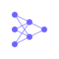

# NeuralVision 🎨

<div align="center">
  
  <h1>Neural<span style="color: #6c63ff">Vision</span></h1>
</div>

A cutting-edge AI-powered image generation platform that transforms your imagination into stunning visual artwork using state-of-the-art AI models. Experience the future of creative expression with our modern, intuitive interface.

## ✨ Features

- 🎨 **Advanced Image Generation**
  - Transform text descriptions into high-quality images
  - Support for multiple art styles and variations
  - Real-time generation progress updates

- 🖼️ **Smart Gallery Management**
  - Automatic image organization and storage
  - Easy browsing and downloading of generated images
  - Pagination support for large collections

- 💫 **Modern User Experience**
  - Sleek, responsive design
  - Dynamic loading animations
  - Intuitive controls and feedback
  - Mobile-friendly interface

- 💡 **Creative Inspiration**
  - Curated prompt suggestions
  - Dynamic prompt categories
  - One-click prompt selection

## 🛠️ Technology Stack

### Frontend
- HTML5 with semantic elements
- CSS3 with modern animations and flexbox/grid layouts
- Vanilla JavaScript for dynamic interactions
- Custom loading animations
- Responsive design principles

### Backend
- Python 3.x
- Flask web framework
- RESTful API architecture
- Async image generation support
- File system management for gallery

### AI Integration
- Replicate API integration
- Support for multiple AI models
- Error handling and fallbacks

### Additional Tools
- Flask-CORS for cross-origin support
- python-dotenv for environment management
- Concurrent processing for parallel image generation

## 🚀 Setup Guide

1. **Clone the Repository**
   ```bash
   git clone https://github.com/deepak-lenka/NeuralVision.git
   cd NeuralVision
   ```

2. **Set Up Virtual Environment**
   ```bash
   python3 -m venv venv
   source venv/bin/activate  # On Windows: venv\Scripts\activate
   ```

3. **Install Dependencies**
   ```bash
   pip install flask python-dotenv requests openai
   ```

4. **Configure Environment**
   Create a `.env` file:
   ```env
   REPLICATE_API_TOKEN=your_api_key_here
   PORT=5013  # Optional, defaults to 5013
   ```

5. **Run the Application**
   ```bash
   python app.py
   ```

6. **Access the Application**
   Open `http://localhost:5013` in your browser

## 🔧 Configuration

### Environment Variables
- `REPLICATE_API_TOKEN`: Your Replicate API key (required)
- `PORT`: Custom port number (optional, default: 5013)
- `DEBUG`: Enable debug mode (optional, default: False)

### Customization
- Image generation settings in `image_generator.py`
- UI themes in `static/css/style.css`
- Gallery settings in `app.py`

## 🌟 Recent Updates

### Version 1.1
- Enhanced UI with modern loading animations
- Improved prompt display and organization
- Optimized image generation process
- Added dynamic prompt suggestions
- Improved mobile responsiveness

### Version 1.0
- Initial release with core functionality
- Basic image generation capabilities
- Simple gallery management
- Fundamental UI components

## 🤝 Contributing

We welcome contributions! Here's how you can help:

1. Fork the repository
2. Create your feature branch (`git checkout -b feature/AmazingFeature`)
3. Commit your changes (`git commit -m 'Add some AmazingFeature'`)
4. Push to the branch (`git push origin feature/AmazingFeature`)
5. Open a Pull Request

## 📝 License

This project is licensed under the MIT License - see the LICENSE file for details.

## 🚨 Troubleshooting

### Common Issues
1. **API Key Issues**
   - Verify your Replicate API key in `.env`
   - Check API key permissions

2. **Installation Problems**
   - Use a virtual environment
   - Update pip: `pip install --upgrade pip`
   - Install dependencies one by one if bulk install fails

3. **Image Generation Errors**
   - Check internet connection
   - Verify API quota
   - Review prompt guidelines

### Getting Help
- Check existing issues on GitHub
- Join our community discussions
- Contact support with detailed error logs

## 🔮 Future Plans

- Integration with additional AI models
- Advanced prompt engineering features
- User accounts and preferences
- Enhanced gallery organization
- Social sharing capabilities

---
Created with ❤️ by Deepak Lenka
